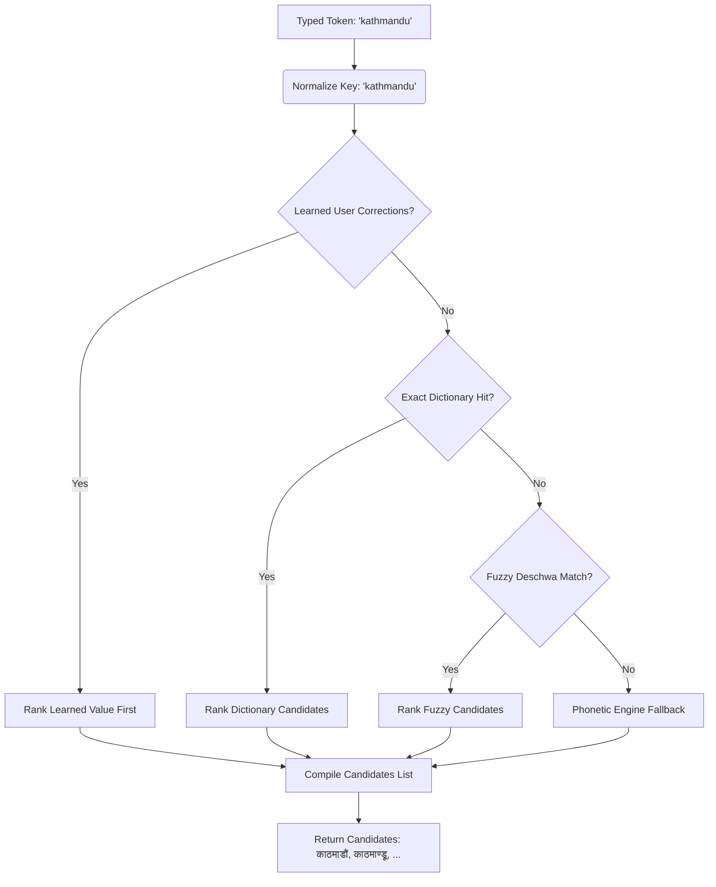

# nepali_transliteration

[](https://pub.dev/packages/nepali_transliteration)
[](https://flutter.dev)
[](https://opensource.org/licenses/MIT)

An offline-first Romanized-to-Nepali transliteration engine and custom Devanagari on-screen keyboard for Flutter.

Unlike simple phonetic engines that force users to type strict input formats (like `kaaThamaaDau*`), this package uses an intelligent dictionary-first suggestion bar layer that maps common loose typing (e.g., `kathmandu`) to correct, ranked Devanagari candidates, with seamless fuzzy/phonetic fallbacks.

---

## Features

* **Offline-First**: Fully offline transliteration. No API calls or network requests.
* **Dictionary-First Suggestions**: Uses a pre-compiled dictionary asset to look up candidate words and phrases exactly how operators actually type.
* **Fuzzy & Deschwa Fallback**: Schwa-tolerant matching (e.g., matching both `kathmandu` and `kathamandu` to `काठमाडौं` using a vowel-collapsing and deschwa index).
* **Pure Phonetic Fallback**: When a word is not found in the dictionary, it falls back to a precise, rule-based phonetic engine (`convertToNepali`).
* **Sentence-Level Transliteration**: Greedy longest-phrase matching algorithm to translate entire sentences or blocks of text non-interactively.
* **Custom Devanagari Keyboard**: A fully custom on-screen keyboard widget (`NepaliKeyboard`) that drives any `TextEditingController` with automatic text shaping (e.g., combining `क` + `ि` into `कि`).

---

## Architecture Overview

The following diagram illustrates how the transliteration process handles a typed token:



---

## Getting started

### 1. Add dependency

Add `nepali_transliteration` to your `pubspec.yaml`:

```yaml
dependencies:
  flutter:
    sdk: flutter
  nepali_transliteration:
    path: path/to/nepali_transliteration
```

### 2. Include the Dictionary Asset

The package requires a dictionary JSON asset to provide suggestions. The asset is automatically resolved by Flutter when you include this package, but ensure that your package root or host app includes the assets section in its `pubspec.yaml` (already pre-configured in this package):

```yaml
flutter:
  assets:
    - packages/nepali_transliteration/assets/nepali/dictionary.json
```

---

## Usage

### 1. Load the Dictionary

Initialize the dictionary at app startup (e.g., in your `main()` function):

```dart
import 'package:nepali_transliteration/nepali_transliteration.dart';

void main() async {
  WidgetsFlutterBinding.ensureInitialized();
  
  // Load dictionary singleton into memory (lazy loaded)
  await NepaliDictionary.load();
  
  runApp(const MyApp());
}
```

Alternatively, you can load it lazily directly within your widget tree using the helper `NepaliDictionaryLoader` widget. It manages loading/error states for you automatically:

```dart
import 'package:nepali_transliteration/nepali_transliteration.dart';

@override
Widget build(BuildContext context) {
  return NepaliDictionaryLoader(
    builder: (context, dictionary) {
      return MyTransliterationScreen(dictionary: dictionary);
    },
    // Optional parameters:
    // loadingBuilder: (context) => const CircularProgressIndicator(),
    // errorBuilder: (context, error) => Text('Error: $error'),
    // onReady: (dictionary) => print('Dictionary loaded!'),
  );
}
```


---

### 2. Get Suggestion Candidates (Interactive Typing)

Query candidates in real time as the user types.

```dart
final dictionary = NepaliDictionary.instance;

// Returns ranked Devanagari candidates: ['काठमाडौं', 'काठमाण्डू', 'काठमाडौ']
List<String> candidates = dictionary.candidates('kathmandu');

// You can pass a learned map of operator corrections to customize rankings
List<String> customCandidates = dictionary.candidates(
  'ram',
  learned: {'ram': 'रामकुमार'},
);
```

#### Session-Level Learning & Persisting Corrections

You can dynamically train the dictionary to prioritize corrections during a session. If a user selects a candidate other than the top-ranked suggestion, register it via `remember` so it is prioritized first in subsequent candidate lists for that word:

```dart
final dictionary = NepaliDictionary.instance;

// Teach the dictionary to rank 'कथ्मन्दु' first for 'kathmandu'
dictionary.remember('kathmandu', 'कथ्मन्दु');

// 'कथ्मन्दु' is now first in candidates
List<String> candidates = dictionary.candidates('kathmandu'); 

// Forget a specific correction
dictionary.forget('kathmandu');

// Clear all corrections learned this session
dictionary.clearLearned();
```

To persist these corrections across application restarts, retrieve a snapshot of the learned corrections, serialize/store it (e.g., via `shared_preferences`), and restore it at app launch:

```dart
// 1. Save snapshot to preferences
Map<String, String> snapshot = dictionary.learnedSnapshot();
await prefs.setString('learned_keys', jsonEncode(snapshot));

// 2. Load and restore snapshot on next launch
Map<String, String> saved = jsonDecode(prefs.getString('learned_keys') ?? '{}');
dictionary.loadLearned(saved);
```


> [!TIP]
> Use these candidates to display a horizontal suggestion bar (like Gboard or SwiftKey) above the keyboard. When a user taps a candidate, replace the active Romanized word with the selected Devanagari candidate.

---

### 3. Translate Whole Sentences

For non-interactive use cases where you want to translate a whole block of text at once, use the sentence transliterater.

```dart
final dictionary = NepaliDictionary.instance;
String text = "mero desh nepal ho";

// Output: "मेरो देश नेपाल हो"
String output = dictionary.sentence(text);
```

---

### 4. Pure Rule-Based Phonetic Engine

If you just need standard character-by-character phonetic mapping without a dictionary:

```dart
import 'package:nepali_transliteration/nepali_transliteration.dart';

// Output: "नमस्ते"
String result = convertToNepali('namaste');
```

#### Phonetic Typing Conventions:
* **Capitalization**: Reserved for retroflex sounds (`T` -> ट, `D` -> ड, `N` -> ण, `Sh` -> ष). Other capitals are folded to lowercase.
* **Syllable Break**: Use `/` or `\` to split a conjunct (`k/h` -> कह, whereas `kh` -> ख).
* **Anusvara / Chandrabindu**: Use `*` for anusvara (ं) and `**` for chandrabindu (ँ) (e.g. `gha**s` -> घाँस).
* **Verbatim Pass-through**: Wrap text in `{...}` to bypass conversion (e.g. `nepal {App}` -> नेपाल App).

> [!WARNING]
> Because case carries meaning (`t` vs `T`, `n` vs `N`, `d` vs `D`, `sh` vs `Sh`), any `TextField` that feeds text into `convertToNepali` or the dictionary's phonetic fallback should use `textCapitalization: TextCapitalization.none`. Otherwise an auto-capitalized first letter (common on name/sentence fields) silently flips a dental consonant to its retroflex counterpart for any word that isn't already a dictionary hit — e.g. an auto-capitalized "Natak" phonetically converts to `णतक` instead of `नतक`.

---

### 5. Custom Devanagari On-Screen Keyboard

Show a custom Devanagari layout directly in your app.

```dart
import 'package:flutter/material.dart';
import 'package:nepali_transliteration/nepali_transliteration.dart';

class KeyboardDemo extends StatefulWidget {
  const KeyboardDemo({super.key});

  @override
  State<KeyboardDemo> createState() => _KeyboardDemoState();
}

class _KeyboardDemoState extends State<KeyboardDemo> {
  final TextEditingController _controller = TextEditingController();
  final FocusNode _focusNode = FocusNode();

  @override
  Widget build(BuildContext context) {
    return Scaffold(
      body: Column(
        children: [
          Expanded(
            child: Center(
              child: TextField(
                controller: _controller,
                focusNode: _focusNode,
                readOnly: true,     // CRITICAL: prevents system keyboard from opening
                showCursor: true,   // Keeps the text cursor blinking
                decoration: const InputDecoration(
                  hintText: 'Tap here to type in Devanagari...',
                ),
              ),
            ),
          ),
          
          // Display the keyboard at the bottom when focused
          if (_focusNode.hasFocus)
            NepaliKeyboard(
              controller: _controller,
              onDone: () => _focusNode.unfocus(),
            ),
        ],
      ),
    );
  }
}
```

---

## Building and Optimizing the Dictionary

The dictionary asset (`assets/nepali/dictionary.json`) is compiled from raw JSON inputs. If you want to modify vocabulary, add custom words, or prune spelling mismatches:

1. Put your raw dictionary JSON files into `tool/nepali_raw/`. Supported schemas are:
   * **Places schema**: `{ "places": [ { "nepali": "...", "roman": [...] } ] }`
   * **General schema**: `[ { "devanagari": "...", "roman": [...] } ]`
2. Run the offline builder script:
   ```bash
   dart run tool/build_nepali_dictionary.dart
   ```
3. The script will automatically:
   * Clean place names by stripping administrative suffixes (like *जिल्ला*, *नगरपालिका*).
   * Validate characters to ensure no corrupt ASCII characters leak into Devanagari strings.
   * Strip short keys (under 3 characters) and English stop-words that crept into raw inputs.
   * Normalize romanized keys (collapsing vowel runs).
   * Flag multi-candidate collisions and vowel-length near-duplicates (e.g., `दीपक` vs `दिपक`) for review.
   * Generate an optimized, sorted `assets/nepali/dictionary.json` file.

---

## Support & Feedback

If you run into any issues, hit a bug, or have suggestions for improvements while using this package, please feel free to reach out. I would love to hear your feedback and help resolve any problems you encounter. You can open an issue on the GitHub repository, or get in touch directly. Thank you for using this package!
